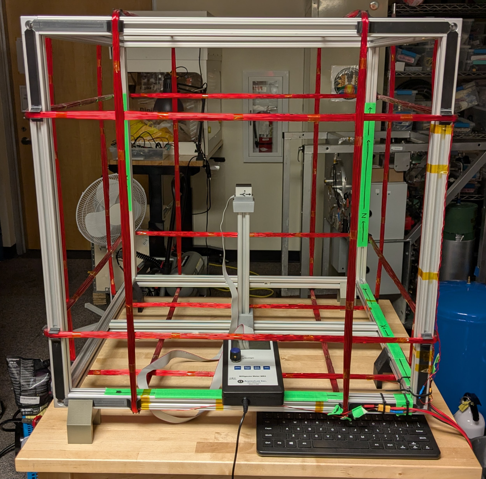

# OreSat Helmholtz Cage

This repo contains design and operating instructions of a Helmholtz Cage, which uses the [Biot Savart Law](https://en.wikipedia.org/wiki/Biot%E2%80%93Savart_law) to get a desired magnetic field inside of an enclosed space using three pairs of perpendicular coils, one pair for each axis. Our fundamental purpose in doing this is to test cubesats' pointing and detumbling capabilities in LEO.

v2.0 is now underway, utilizing less hardware than v1.0. This is excellent news for everyone involved, as less parts means less things that can and will break. We are using a Raspberry Pi Pico to run it, with each set of coils getting their own motor driver, to drive the current, and a INA226 to monitor the current. A full schematic can be found [here](./controller-v2/helmholtz-controller-v2.kicad_sch). A PCB layout is in the works.

# Design Notes

**Status, design, and testing information can be found in the [OreSat Helmholtz Cage Design Notes](https://docs.google.com/document/d/1s9UlxD-V_3-_QfmXqKaY5oYsfC2GDHxeAkWD0VgjS5g/edit?tab=t.0).**

A seperate doc on the structure and design of the cage itself can be found [here](./docs/Open%20Source%20Document.docx). This doc is a bit out of date in some aspects, mainly the technical hardware, but serves as a good resource for cage construction and theory.

## Pictures
MCECS BETA Project 2018:

Current Build:
